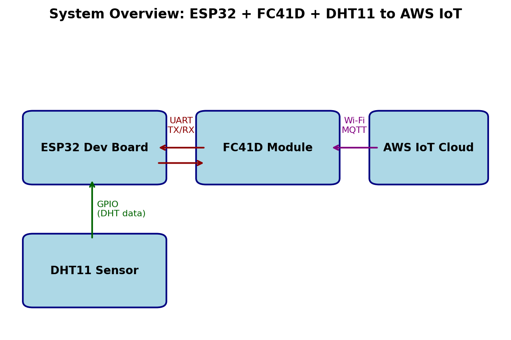
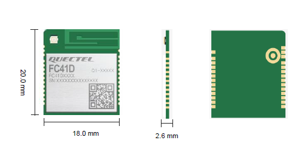

# FC41D-Quectel‑to‑AWS‑IoT

This project demonstrates how to connect a **Quectel FC41D Wi‑Fi/Bluetooth module** to **AWS IoT Core** and publish sensor data using **AT commands**.  It is based on the open‑source [ESP32‑AWS‑IoT template](https://github.com/survivingwithandroid/ESP32-AWS-IoT) but has been re‑implemented for the FC41D module.

Instead of using the ESP32’s built‑in Wi‑Fi stack, the FC41D is controlled over a UART using the module’s AT command interface.  An ESP32 development board reads a DHT11 temperature and humidity sensor and uses the FC41D to connect to a Wi‑Fi access point, establish an MQTT connection to AWS IoT Core and publish JSON messages.

## How it works

1. **Wi‑Fi connection** – The FC41D is set to station mode and instructed to join a Wi‑Fi access point with `AT+QSTAAPINFO=&lt;SSID&gt;,&lt;pwd&gt;`.  When the module reports `+QSTASTAT:WLAN_CONNECTED` and `+QSTASTAT:GOT_IP` the device has successfully acquired an IP address【693478592633391†L6369-L6378】.

2. **SSL and MQTT configuration** – After loading the CA certificate, device certificate and private key with `AT+QSSLCERT` the module is configured for MQTT over TLS.  Example commands from the official access guide include enabling all cipher suites (`AT+QSSLCFG="ciphersuite",1,0xFFFF`), enabling clean session (`AT+QMTCFG="session",1,1`) and turning on SSL/TLS verification【966357325308740†L505-L520】.

3. **Opening the MQTT connection** – The command `AT+QMTOPEN=1,"your‑endpoint‑ats.iot.region.amazonaws.com",8883` opens a TLS socket to AWS IoT Core【966357325308740†L521-L523】.  When the `+QMTOPEN: 1,0` URC is received the socket is ready.

4. **Connecting the MQTT client** – After the socket is open the client connects to AWS IoT Core with `AT+QMTCONN=1,"yourThingName"`【966357325308740†L524-L528】.  You may also subscribe to the device shadow topics with `AT+QMTSUB` if you need to receive updates.

5. **Publishing data** – The ESP32 reads temperature and humidity from the DHT11 sensor and builds a small JSON document.  To publish the message the code constructs an `AT+QMTPUB` command of the form `AT+QMTPUB=1,1,1,0,"&lt;topic&gt;",&lt;length&gt;,"&lt;json&gt;"`.  QoS 1 is used so that the module will retry until an acknowledgement is received.

The included `src/main.cpp` encapsulates these steps in Arduino code.  It uses `HardwareSerial` to talk to the FC41D on a second UART and prints all responses on the primary USB serial port for debugging.

## Getting started

1. **Hardware** – Connect the FC41D module to your ESP32 board using a free UART (for example, GPIO 16 as RX and GPIO 17 as TX).  Power the module as described in the datasheet.  Connect a DHT11 sensor to GPIO 4 (or modify `DHT_PIN` in the code).

2. **Certificates** – Download your AWS IoT device certificates and load them into the FC41D using the commands illustrated in the official access guide【966357325308740†L505-L520】.  The `certs.h` file in this repository contains placeholders where you can paste the PEM‑encoded certificates if you wish to send them to the module over the serial port.

3. **Configure `aws.h`** – Edit `src/aws.h` and set `AWS_END_POINT`, `DEVICE_NAME` and `MQTT_TOPIC` to match your AWS IoT settings.

4. **Build and upload** – This project uses [PlatformIO](https://platformio.org/).  Install PlatformIO in VS Code, open this folder and click **Build** → **Upload**.  Alternatively run `pio run --target upload` from the command line.

5. **Monitor** – Open the serial monitor at 115200 bps to see AT command output and sensor readings.

## A note about BLE

The FC41D also supports BLE connectivity.  The AT commands for BLE are documented in the same manual and include `AT+QBLEINIT`, `AT+QBLESCAN` and `AT+QBLECONN`【693478592633391†L6392-L6531】.  They are not used in this example but you can extend the project if needed.

## Reference

* **Quectel FC41D Wi‑Fi&Bluetooth Module AWS IoT Platform Access Guide**【966357325308740†L495-L529】.
* **Quectel FC41D AT Commands Manual**【693478592633391†L6369-L6378】.

## Why FC41D?

The FC41D module is more than just a wireless transceiver – it contains its own microcontroller and offers a rich feature set that makes it an attractive choice for IoT products:

* **Low‑power, cost‑effective MCU + wireless combo** – FC41D integrates a 120 MHz ARM core with 256 KB RAM and 2 MB/4 MB flash【1290545695481†L521-L548】.  This eliminates the need for a separate Wi‑Fi/Bluetooth chipset and reduces BOM cost.
* **Dual wireless connectivity** – It supports both Wi‑Fi 4 (IEEE 802.11 b/g/n) and Bluetooth 5.2【1290545695481†L521-L548】【87468609204021†L28-L33】.  Wi‑Fi can operate in AP or STA mode【1290545695481†L592-L603】, while BLE makes it easy to add mobile phone provisioning or sensor networks.
* **Compact form factor** – The module measures only 20 × 18 × 2.6 mm and weighs about 1.5 g【1290545695481†L546-L548】【87468609204021†L15-L17】, so it can be embedded into space‑constrained designs.
* **Multiple interfaces** – FC41D exposes UART, SPI, I²C, ADC, PWM and up to 19 GPIOs【87468609204021†L18-L31】, giving you flexibility to connect sensors, actuators or a host MCU.
* **Robust security and certifications** – The module supports WPA‑PSK/WPA2‑PSK/WPA3‑SAE Wi‑Fi encryption and can store TLS certificates for AWS IoT【87468609204021†L14-L22】.  It is certified for CE, FCC, IC, Anatel, RCM, KC and TELEC【87468609204021†L88-L97】, simplifying product compliance.
* **Standard AT commands** – A simple AT command set allows any host microcontroller to control the module.  Quectel’s **QuecOpen** firmware also supports public cloud integrations【87468609204021†L23-L26】.

## Advantages over using the ESP32’s built‑in Wi‑Fi/Bluetooth

Using an external FC41D module instead of the ESP32’s native wireless stack offers several benefits:

* **Offloaded networking** – The FC41D handles Wi‑Fi/BLE protocols internally, freeing the ESP32’s CPU to focus on application logic.  This can reduce code complexity and improve real‑time responsiveness.
* **Pre‑certified radio** – Because the FC41D carries global certifications【87468609204021†L88-L97】, your end product can inherit these approvals without going through full radio testing, which can save time and cost.
* **Flexible antenna options** – Depending on the order code you can choose a PCB antenna, IPEX connector or external ANT_WIFI/BT pin【1290545695481†L672-L675】【87468609204021†L32-L33】.  This lets you optimise range and mechanical integration.
* **BLE 5.2 support** – Not all ESP32 variants support the latest BLE features.  FC41D provides Bluetooth 5.2 with GATT and BLE operation modes【1290545695481†L603-L608】.
* **Wide operating temperature range** – The module operates from –40 °C to +85 °C【1290545695481†L632-L635】, making it suitable for industrial environments.

## Documentation

Quectel publishes comprehensive documents to help you integrate the FC41D:

| Document | Description |
|---|---|
| **FC41D Wi‑Fi & Bluetooth Module Specification** | Summarises key features, electrical characteristics and certification information【87468609204021†L8-L23】【87468609204021†L88-L97】. |
| **FC41D Hardware Design** | Provides detailed pinouts, power supply recommendations and PCB layout guidelines.  It includes the functional block diagram【1290545695481†L646-L668】 and reference circuits. |
| **FC41D AWS IoT Platform Access Guide** | Describes how to connect the module to AWS IoT Core using AT commands【966357325308740†L495-L529】. |
| **FC41D AT Commands Manual** | Lists all AT commands for Wi‑Fi, Bluetooth and peripheral interfaces【693478592633391†L6369-L6378】. |

## Diagram and schematic

The diagram below illustrates the high‑level architecture of this project.  An ESP32 development board reads a DHT11 sensor and communicates with the FC41D over a secondary UART.  The FC41D module then connects to AWS IoT Core via Wi‑Fi and publishes MQTT messages.  BLE functionality is available but unused here.

For a visual reference of the module itself you can consult the FC41D datasheet or view the picture below:

If you require a full schematic, please refer to the official hardware design document’s reference circuits【1290545695481†L646-L668】.  They show recommended power supply filtering, antenna matching and UART interface wiring.